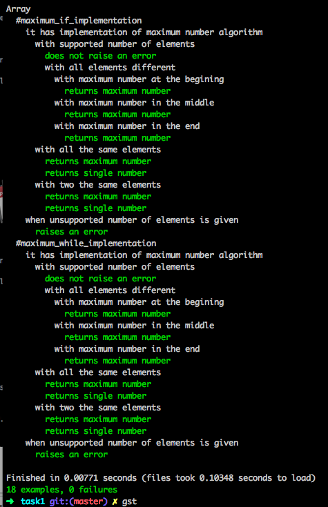

# Tests for PPJ homework
*(feeling awesome doing `ruby` code for `java` lectures)*

RSpec `doc` output:



```
Array
  #maximum_if_implementation
    it implements: maximum_number_algorithm
      with supported number of elements
        does not raise an error
        with all elements different
          with maximum number at the begining
            returns maximum number
          with maximum number in the middle
            returns maximum number
          with maximum number in the end
            returns maximum number
      with all the same elements
        returns maximum number
        returns single number
      with two the same elements
        returns maximum number
        returns single number
    when unsupported number of elements is given
      raises an error
  #maximum_while_implementation
    it implements: maximum_number_algorithm
      with supported number of elements
        does not raise an error
        with all elements different
          with maximum number at the begining
            returns maximum number
          with maximum number in the middle
            returns maximum number
          with maximum number in the end
            returns maximum number
      with all the same elements
        returns maximum number
        returns single number
      with two the same elements
        returns maximum number
        returns single number
    when unsupported number of elements is given
      raises an error
```
